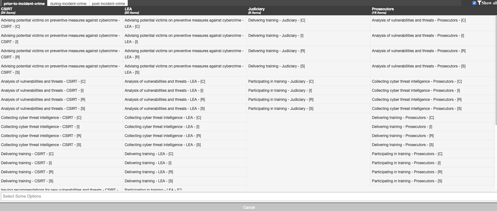

# SoD-Matrix : Segregation (or separation) of Duties (SoD) Matrix for CSIRTs, LEA and Judiciary

This is the Segregation (or separation) of Duties (SoD) Matrix for CSIRTs, LEA and Judiciary. See [An overview on enhancing technical cooperation between CSIRTs and LE](https://www.enisa.europa.eu/publications/support-the-fight-against-cybercrime-tools-for-enhancing-cooperation-between-csirts-and-le).

The SoD matrix is made available in 
* JSON: a machine readable format (JSON) : ```machinetag.json```
* MD: a human deable format (MD) : ```sod.md```
* Galaxy/Cluster: a format usable by [MISP](https://www.misp-project.org/) : ```galaxies_sod-matrix.json and clusters_sod-matrix.json```

# Format

The SoD is build from the machinetag.json file. There are three **phases** (prior-to-incident-crime, during-the-incident-crime and post-incident-crime) and four **actors** (CSIRT, LEA, Judiciary and Prosecutors). Each phase consists of multiple **duties**. 

The SoD matrix uses a flavor of COBIT5 to assign **roles** (R-Responsible, C-Consulted, S-Supporting, I-informed, the A is not assigned).

Because each country or constituency can have their own interpretation of the roles and duties per actors, the JSON file assigns a generic role with 'x', without determing the exact role (R,C,S,I). During the conversion from machinetag to the MISP galaxy, entries for all the roles (meaning R, C, S and I) are included.

## Indicative examples

The tasks and ticks in the SoD matrix are for now **indicative examples**.

## Summary

* JSON, machine reabable: only generic roles (with x) per duties
* MISP Galaxy: MISP readable, all roles (RCSI) per duties

# Updating the table

1. Change machinetag.json
1. Run the conversion script, create the MD version for human readable or the Galaxy version for MISP galaxy (or both)
1. If MISP, remove the last comma in the cluster file
1. Copy the file into MISP 
1. Update Galaxies in MISP

# Conversion

## Create the table

Run the script machinetag2human.py with input machinetag.json
```python3 machinetag2human.py machinetag.json md```

## Create the MISP Galaxy and Clusters

Run the script machinetag2human.py with input machinetag.json
```python3 machinetag2human.py machinetag.json galaxy```

!! *After the conversion*, you need to remove the last comman in the cluster file.

Copy the files into your MISP installation and then update the Galaxies in MISP.


    cp clusters_sod-matrix.json /var/www/MISP/app/files/misp-galaxy/clusters/sod-matrix-reverse.json
    cp galaxies_sod-matrix.json /var/www/MISP/app/files/misp-galaxy/galaxies/sod-matrix-reverse.json


# MISP example



# SoD Matrix

**IMPORTANT**

The below tasks and ticks in the SoD matrix are **indicative examples**.

# Segregation (or separation) of Duties (SoD) Matrix for CSIRTs, LEA and Judiciary (human readable version)
This is the Segregation (or separation) of Duties (SoD) Matrix for CSIRTs, LEA and Judiciary.
This SoD is also available as a [MISP taxonomy](https://github.com/MISP/misp-taxonomies).
See [An overview on enhancing technical cooperation between CSIRTs and LE](https://www.enisa.europa.eu/publications/support-the-fight-against-cybercrime-tools-for-enhancing-cooperation-between-csirts-and-le)
Version: 1
Generated from machine readable version. Please **DO NOT** edit this file directly in github, rather use the machinetag.json file.
| Phase                               | Cybercrime Fighting Activities      | CSIRT | LEA | Judge | Prosec | Training topics |
|-----------------------------------  |-----------------------------------  | :---: | :---: | :---: | :---: |-----------|
| Prior to incident/crime | Delivering training | x | x | x  | x | Problem-solving and critical thinking skills |
| Prior to incident/crime | Participating in training | x | x | x  | x | Problem-solving and critical thinking skills |
| Prior to incident/crime | Collecting cyber threat intelligence | x | x |   | x | Knowledge of cyber threat intelligence landscape |
| Prior to incident/crime | Analysis of vulnerabilities and threats | x | x |   | x | Development and distribution of tools for preventive and reactive mitigation |
| Prior to incident/crime | Issuing recommendations for new vulnerabilities and threats | x |  |   |  | Dealing with specific types of threats and vulnerabilities |
| Prior to incident/crime | Advising potential victims on preventive measures against cybercrime | x | x |   |  | Raising awareness on preventive measures against cybercrime |
| During the incident/crime | Discovery of the cyber security incident/crime | x | x |   |  | Digital investigations; forensics tools; penetration testing; vulnerability scanning; flow analysis |
| During the incident/crime | Identification and classification of the cyber security incident/crime | x | x |   | x | Incident and crime classification and identification |
| During the incident/crime | Identify the type and severity of the compromise | x | x |   | x | Knowledge of cyber threats and incident response procedures |
| During the incident/crime | Evidence collection | x | x |   | x | Knowledge of what kind of data to collect; organisation skills |
| During the incident/crime | Providing technical expertise | x |  |   |  | Technical skills |
| During the incident/crime | Preserving the evidence that may be crucial for the detection of a crime in a criminal trial | x | x |   | x | Digital investigations; forensics tools; |
| During the incident/crime | Advising the victim to report / obligation to report a cybercrime to law enforcement (LE) | x |  |   | x | Obligations and restriction on information sharing; communication channels |
| During the incident/crime | Duty to inform the victim of a cybercrime | x | x |   | x | Obligations and restrictions to the information sharing |
| During the incident/crime | Duty to inform other stakeholders/authorities (operators of vulnerable systems, data protection authorities, telecommunications authorities, etc.) | x |  |   |  | Obligations and rules for information sharing among communities |
| During the incident/crime | Acting as a single point of contact (PoC) for any communication with other EU Member States for the incident handling | x |  |   |  | Communication skills; communication channel |
| During the incident/crime | Mitigation of an incident | x |  |   |  | Well-prepared & well-organised to react promptly in an incident |
| During the incident/crime | Conducting the criminal investigation |  | x |   | x | Knowledge of the legal framework; decision- making skills |
| During the incident/crime | Leading the criminal investigation |  |  | x  | x | Knowledge of the incident response plan; leadership skills |
| During the incident/crime | In the case of disagreement, the final say for an investigation |  |  | x  | x | Knowledge of the legal framework; decision- making skills |
| During the incident/crime | Authorizing the investigation carried out by the LE |  | x | x  | x | Decision-making in the criminal procedure |
| During the incident/crime | Ensuring that fundamental rights are respected during the investigation and prosecution | x | x | x  | x | Fundamental rights in criminal investigations and prosecutions |
| Post incident/crime | Systems recovery | x |  |   |  | Technical skills |
| Post incident/crime | Protecting the constituency | x |  |   |  | Drafting and establishing procedures; technical knowledge |
| Post incident/crime | Preventing and containing IT incidents from a technical point of view | x |  |   |  | Technical skills pertaining to system administration, network administration, technical support or intrusion detection |
| Post incident/crime | Analysis and interpretation of collected evidence |  | x | x  | x | Criminalistics, digital forensics, admissible evidence |
| Post incident/crime | Requesting testimonies from CSIRTs and LE |  |  | x  | x | Testimonies in a criminal trial |
| Post incident/crime | Admitting and assessing the evidence |  |  | x  | x | Evidence in a criminal trial |
| Post incident/crime | Judging who committed a crime |  |  | x  |  | Technical knowledge and knowledge of the legal framework |
| Post incident/crime | Assessing incident damage and cost | x | x | x  | x | Evaluation skills |
| Post incident/crime | Reviewing the response and update policies and procedures | x |  |   |  | Knowledge how to draft an incident response and procedures |
